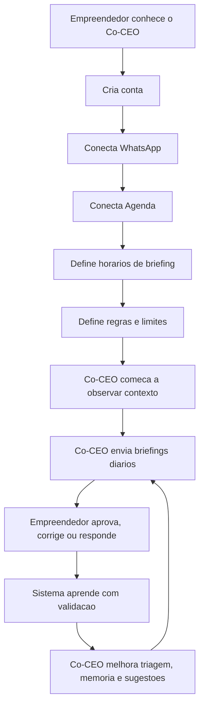
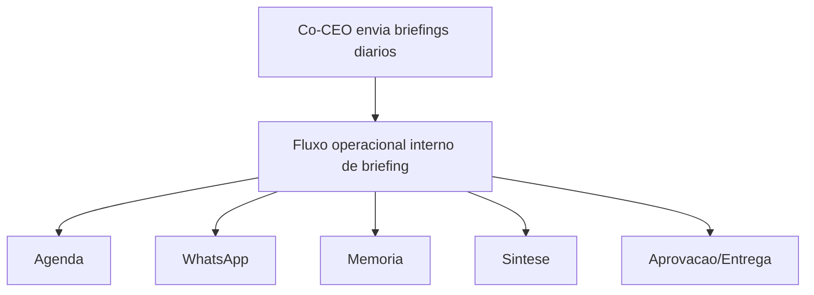

# Jornada Macro e Orquestracao Operacional do MVP Co-CEO

## Objetivo do Artefato

Este documento descreve a jornada macro do usuario no MVP e mostra como essa jornada se conecta aos fluxos operacionais internos do Co-CEO.

Ele nao e um PRD completo, nem um diagrama de casos de uso. E um mapa de entendimento para alinhar produto, tecnologia e comercial.

## Jornada Macro do Usuario

## Leitura da Jornada

A jornada macro mostra o ciclo principal da v0:

1. O empreendedor entra no produto.
2. Conecta as fontes minimas de contexto.
3. Define limites de atuacao.
4. O Co-CEO observa sinais relevantes.
5. O sistema entrega briefings e sugestoes.
6. O empreendedor aprova, corrige ou responde.
7. O sistema transforma validacoes em aprendizado operacional.

O valor aparece quando o empreendedor nao precisa organizar tudo manualmente para entender o que importa.

## Ponte Entre Jornada e Operacao

## Onde Este Artefato Entra

Este documento fica entre a conceituacao do produto e a especificacao tecnica.

Ele ajuda a responder:

- qual e a experiencia principal do usuario;
- quais eventos disparam valor;
- onde entram WhatsApp, Agenda e memoria;
- por que aprovacao humana e parte central do produto;
- quais partes precisam virar subjornadas detalhadas.

## Subjornadas Que Devem Ser Detalhadas Depois

- Onboarding e conexao de canais.
- Briefing diario.
- Briefing pre-reuniao.
- Triagem de WhatsApp.
- Sugestao e aprovacao de resposta.
- Criacao e validacao de memoria operacional.
- Tratamento de erros e indisponibilidade de integracoes.

