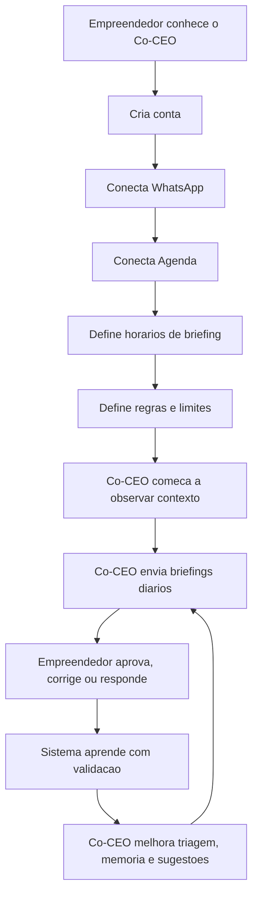
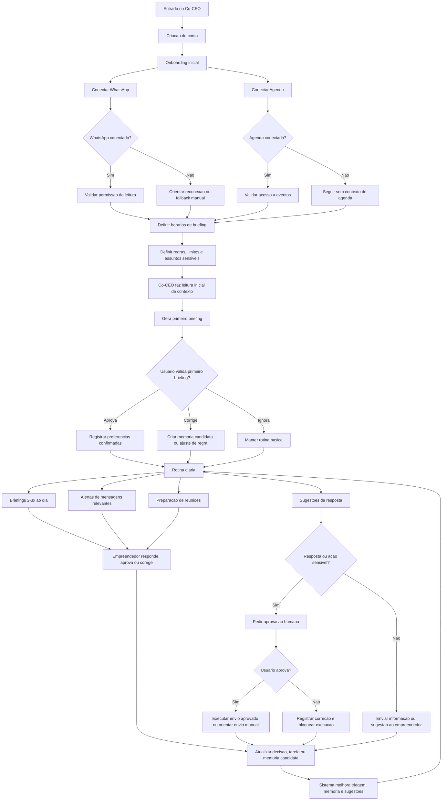
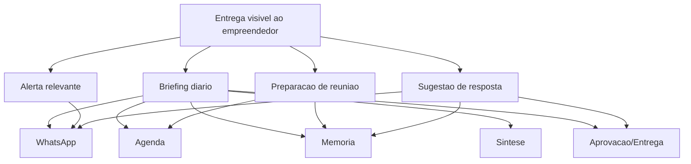

# Jornada Macro do MVP Co-CEO

## Objetivo do Artefato

Este documento descreve a jornada macro do usuario no MVP do Co-CEO.

Ele mostra o fluxo ponta a ponta do empreendedor usando o produto, desde a entrada inicial ate a rotina diaria de briefings, aprovacoes, correcoes e aprendizado operacional.

Este artefato nao e um PRD completo, nem um diagrama de casos de uso. Ele serve como mapa de entendimento para alinhar produto, tecnologia, comercial e as subjornadas que serao detalhadas depois.

## Versoes da Jornada

Este documento contem duas camadas:

- **Etapa 1.1: Jornada macro resumida** - versao curta para explicar o ciclo central do MVP.
- **Etapa 1.2: Jornada macro expandida** - versao mais completa para orientar as proximas subjornadas.

## Premissas do MVP

O MVP do Co-CEO e WhatsApp-first.

O objetivo inicial e provar que o Co-CEO consegue:

- ler e entender o contexto do WhatsApp;
- identificar o que importa;
- reduzir ruido;
- preparar o empreendedor para decisoes e reunioes;
- sugerir respostas;
- pedir aprovacao humana em comunicacoes sensiveis;
- usar Agenda como apoio contextual;
- aprender com validacoes do usuario.

O MVP nao deve tentar ser autopilot completo. Ele atua principalmente nos niveis iniciais da escada de autonomia: observa, resume, sugere e executa apenas com aprovacao.

## Jornada Macro Resumida

## Leitura da Jornada Resumida

A jornada resumida mostra o ciclo principal da v0:

1. O empreendedor entra no produto.
2. Conecta as fontes minimas de contexto.
3. Define limites de atuacao.
4. O Co-CEO observa sinais relevantes.
5. O sistema entrega briefings e sugestoes.
6. O empreendedor aprova, corrige ou responde.
7. O sistema transforma validacoes em aprendizado operacional.

O valor aparece quando o empreendedor nao precisa organizar tudo manualmente para entender o que importa.

## Jornada Macro Expandida

## Leitura da Jornada Expandida

A jornada expandida deixa explicito que o MVP tem quatro grandes momentos:

1. **Entrada e configuracao**: o usuario cria conta, conecta canais e define limites.
2. **Primeira leitura de contexto**: o Co-CEO tenta entender WhatsApp, Agenda e preferencias iniciais.
3. **Primeira entrega de valor**: o sistema gera um primeiro briefing para o usuario validar, corrigir ou ignorar.
4. **Rotina operacional**: o Co-CEO envia briefings, alertas, preparacao de reuniao e sugestoes de resposta.

O ciclo de melhoria acontece quando o empreendedor aprova, corrige ou responde. Essas interacoes viram sinais para melhorar triagem, memoria, sugestoes e proximos briefings.

## Estados da Jornada

### 1. Nao iniciado

O empreendedor conhece o Co-CEO, mas ainda nao criou conta.

### 2. Conta criada

O usuario entrou no produto, mas ainda nao conectou os canais necessarios para gerar valor.

### 3. Canais conectados

WhatsApp e Agenda estao conectados ou parcialmente conectados.

### 4. Configuracao minima concluida

O usuario definiu horarios de briefing, limites e assuntos sensiveis.

### 5. Observacao inicial

O Co-CEO comeca a ler sinais e montar contexto, ainda sem muita memoria validada.

### 6. Primeiro valor entregue

O primeiro briefing, alerta ou preparacao de reuniao e entregue ao empreendedor.

### 7. Rotina ativa

O sistema opera em ciclo diario, com briefings, alertas, sugestoes e preparacao de reunioes.

### 8. Aprendizado em andamento

Correcoes, aprovacoes e respostas do usuario alimentam memoria candidata, regras e melhoria de contexto.

## Momentos de Valor

Os principais momentos de valor do MVP sao:

- primeiro briefing util;
- identificacao de mensagens importantes no WhatsApp;
- reducao de ruido;
- alerta de pendencia relevante;
- preparacao antes de reuniao;
- sugestao de resposta pronta para revisar;
- aprovacao humana simples pelo WhatsApp;
- aprendizado visivel a partir de uma correcao do usuario.

## Pontos de Decisao do Usuario

O usuario precisa decidir:

- se conecta WhatsApp;
- se conecta Agenda;
- quais horarios de briefing deseja;
- quais assuntos sao sensiveis;
- se aprova ou corrige o primeiro briefing;
- se uma sugestao de resposta deve ser enviada;
- se uma regra ou memoria candidata deve ser confirmada;
- se uma acao deve continuar manual ou pode ganhar mais autonomia depois.

## Pontos de Aprovacao Humana

No MVP, o Co-CEO deve pedir aprovacao quando houver:

- resposta para cliente, lead ou parceiro;
- negociacao;
- cobranca;
- promessa comercial;
- reagendamento com terceiro;
- comunicacao juridica, financeira ou reputacionalmente sensivel;
- criacao de regra operacional importante;
- memoria sensivel que possa afetar decisoes futuras.

## Falhas e Excecoes

A jornada precisa prever excecoes sem quebrar a experiencia.

### WhatsApp nao conecta

O sistema deve orientar reconexao ou oferecer fallback manual.

### Agenda nao conecta

O Co-CEO pode operar apenas com WhatsApp, mas deve deixar claro que preparacao de reuniao fica limitada.

### Envio oficial nao esta disponivel

O Co-CEO deve sugerir a resposta e orientar o usuario a enviar manualmente.

### Usuario ignora briefing

O sistema deve manter a rotina basica sem assumir que o briefing foi aprovado.

### Usuario corrige o sistema

A correcao deve virar sinal de ajuste, memoria candidata ou regra pendente de confirmacao.

### Memoria incerta

O sistema nao deve tratar memoria incerta como verdade. Ela deve permanecer candidata ate validacao.

## Ponte Entre Jornada e Operacao

A jornada macro descreve a experiencia do usuario. A operacao interna esta detalhada em `03-orquestracao-operacional.md`.

Esta ponte mostra como uma entrega visivel da jornada depende de capacidades internas:

## O Que Esta Jornada Ainda Nao Detalha

Esta jornada ainda nao detalha o passo a passo interno de cada fluxo.

Esses detalhes entram nas subjornadas:

- onboarding e conexao de canais;
- WhatsApp;
- briefings;
- preparacao de reuniao;
- sugestao e aprovacao de resposta;
- memoria operacional.

## Subjornadas Derivadas

A partir desta jornada macro, as proximas etapas sao:

- Subjornada de onboarding.
- Subjornada do WhatsApp.
- Subjornada de briefings.
- Subjornada de preparacao de reuniao.
- Subjornada de sugestao e aprovacao de resposta.
- Subjornada de memoria operacional.
- Tratamento de erros e indisponibilidade de integracoes.

