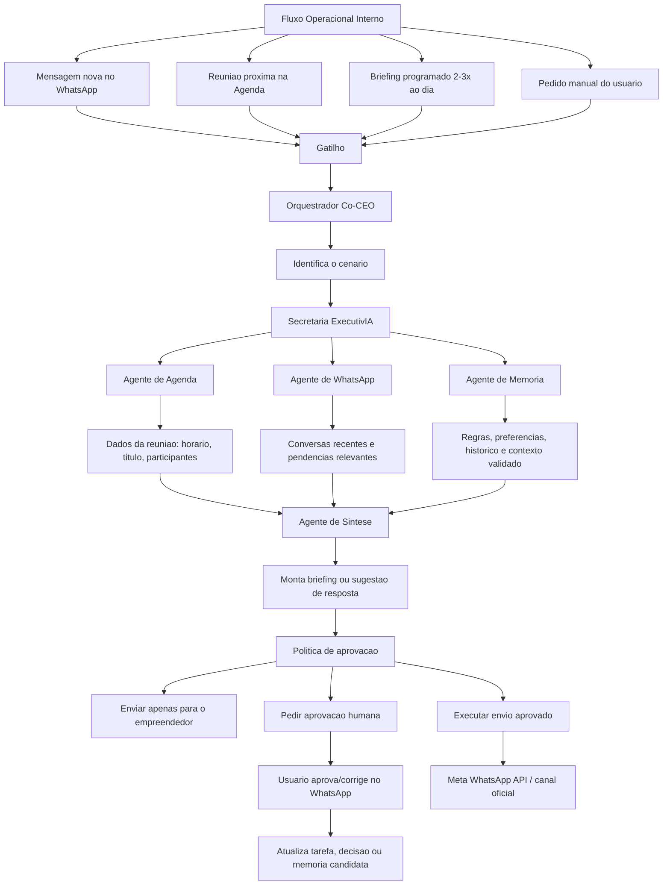

# Orquestracao Operacional do MVP Co-CEO

## Objetivo

Este documento descreve como o Co-CEO deve funcionar internamente na v0 para transformar eventos do WhatsApp, da Agenda e do usuario em briefings, sugestoes e acoes aprovadas.

## Modelo Mental

O Co-CEO e o orquestrador central.

Os agentes ou funcionarios de IA sao modulos especializados chamados conforme o cenario. Na v0, eles nao conversam livremente entre si e nao precisam ser expostos como contatos separados para o usuario.

## Fluxo Operacional Interno

## Gatilhos

O sistema pode ser acionado por:

- mensagem nova no WhatsApp;
- reuniao proxima na Agenda;
- briefing programado;
- pedido manual do usuario pelo WhatsApp.

Cada gatilho deve ser classificado antes de qualquer acao. O Co-CEO precisa entender se o caso pede resumo, alerta, sugestao, preparacao de reuniao, follow-up ou apenas registro.

## Papel dos Modulos

### Orquestrador Co-CEO

Recebe o evento, identifica o cenario, escolhe quais modulos chamar e aplica politicas de seguranca, aprovacao e entrega.

### Secretaria ExecutivIA

E o primeiro funcionario operacional. Coordena a experiencia de briefing, triagem, preparacao de reuniao e sugestao de resposta.

### Agente de Agenda

Busca contexto de calendario:

- horario;
- titulo;
- participantes;
- descricao;
- proximas reunioes;
- conflitos basicos.

### Agente de WhatsApp

Busca e resume contexto conversacional:

- conversas recentes;
- mensagens relevantes;
- pendencias;
- pessoas envolvidas;
- possiveis urgencias;
- ruido a ignorar ou reduzir.

### Agente de Memoria

Recupera contexto validado:

- regras operacionais;
- preferencias do empreendedor;
- historico relevante;
- relacoes importantes;
- diretrizes de comunicacao;
- memorias candidatas pendentes de validacao.

### Agente de Sintese

Consolida os sinais e monta uma saida clara:

- briefing;
- resumo;
- sugestao de resposta;
- pontos de decisao;
- perguntas recomendadas;
- alertas.

### Agente de Aprovacao e Entrega

Decide o tratamento final:

- enviar apenas para o empreendedor;
- pedir aprovacao humana;
- bloquear acao sensivel;
- executar envio aprovado;
- registrar correcao ou aprendizado.

## Regra de Aprovacao Humana

No MVP, comunicacoes sensiveis nao devem ser enviadas sem autorizacao do empreendedor.

Exemplos de casos que exigem aprovacao:

- resposta para cliente;
- negociacao;
- cobranca;
- promessa comercial;
- alteracao de agenda com terceiros;
- mensagem juridica, financeira ou reputacionalmente sensivel.

## WhatsApp: Leitura e Escrita

A arquitetura considerada para a v0 e hibrida:

- Baileys para leitura e espelhamento do WhatsApp;
- Meta WhatsApp API para escrita oficial quando possivel;
- fallback manual quando envio oficial nao estiver pronto ou nao for compativel.

O fallback manual significa que o Co-CEO pode sugerir a resposta e o usuario copia, ajusta ou envia.

## Memoria Operacional

Memoria nao e historico bruto.

O sistema deve separar:

- mensagens brutas;
- tarefas;
- decisoes;
- resumos;
- memorias candidatas;
- memorias confirmadas;
- vetores de busca semantica.

Uma memoria importante deve ter evidencia, escopo, status, sensibilidade e preferencialmente validacao do usuario.

## Decisao de Produto

Na v0, o usuario deve sentir que conversa com o Co-CEO no WhatsApp.

Por tras, o sistema pode usar agentes especializados. Mas a experiencia externa deve ser simples:

> um Co-CEO que entende contexto, prepara o empreendedor e pede aprovacao quando precisa agir.

