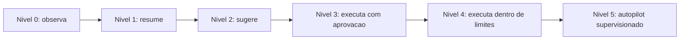

# Mapa da Plataforma Co-CEO e Escada de Autonomia

## Objetivo do Artefato

Este documento descreve o mapa conceitual da plataforma Co-CEO.

O objetivo e separar claramente:

- o que e plataforma;
- o que e funcionario de IA;
- o que e agente tecnico interno;
- o que e workflow;
- o que e integracao;
- o que e capacidade transversal;
- como a plataforma evolui em direcao a autopilot.

Este artefato nao substitui o PRD do MVP. Ele serve como mapa de plataforma para orientar produto, tecnologia, comercial e roadmap.

## Tese de Plataforma

O Co-CEO e uma plataforma operacional de funcionarios de IA para empreendedores brasileiros.

A direcao de longo prazo e aproximar a plataforma de um autopilot empresarial supervisionado: um sistema que observa contexto, entende prioridades, sugere acoes, executa tarefas dentro de limites e escala para o empreendedor quando uma decisao humana for necessaria.

No MVP, o Co-CEO ainda nao e autopilot completo. Ele inicia a escada de autonomia:

- observa;
- resume;
- prioriza;
- sugere;
- executa apenas com aprovacao humana clara.

## Taxonomia

### Co-CEO

E a plataforma-mae.

Responsavel por reunir interfaces, orquestracao, funcionarios de IA, memoria, integracoes, governanca e niveis de autonomia.

### Funcionario de IA

E uma abstracao de produto baseada em cargo ou funcao empresarial.

Exemplos:

- Secretaria ExecutivIA;
- Financeiro/Contador;
- Comercial/SDR;
- Cobranca;
- Juridico;
- RH/Contratacao;
- Marketing.

O funcionario de IA e a forma mais facil de explicar valor para o usuario e para o comercial.

### Agente Tecnico

E um modulo interno especializado, chamado pelo orquestrador quando necessario.

Exemplos:

- agente de WhatsApp;
- agente de Agenda;
- agente de Memoria;
- agente de Sintese;
- agente de Aprovacao e Entrega;
- agente de CRM.

Na v0, esses agentes nao aparecem como contatos separados e nao conversam livremente entre si.

### Workflow

E um processo executavel que combina agentes, memoria, integracoes e regras.

Exemplos:

- briefing pre-reuniao;
- briefing diario;
- triagem de WhatsApp;
- sugestao e aprovacao de resposta;
- deteccao de follow-up;
- criacao de memoria candidata;
- atualizacao de CRM.

### Integracao

E uma conexao com sistema externo.

Exemplos:

- WhatsApp;
- Google Calendar;
- CRM;
- e-mail;
- ferramentas financeiras;
- ferramentas de documentos.

### Capacidade Transversal

E uma capacidade usada por varios funcionarios de IA.

Exemplos:

- triagem;
- sintese;
- memoria operacional;
- aprovacao humana;
- politicas de risco;
- logs;
- rastreabilidade;
- sugestao de resposta;
- briefings.

### Nivel de Autonomia

E o grau de liberdade que o Co-CEO tem para agir.

Cada workflow e funcionario de IA pode operar em um nivel diferente de autonomia, dependendo do risco, da confianca, da integracao disponivel e das permissoes do usuario.

## Mapa em Camadas

```mermaid
flowchart TD
    A["Co-CEO Plataforma"] --> B["Interfaces"]
    A --> C["Orquestrador Central"]
    A --> D["Funcionarios de IA"]
    A --> E["Capacidades Transversais"]
    A --> F["Integracoes"]
    A --> G["Dados e Memoria"]
    A --> H["Governanca e Autonomia"]

    B --> B1["WhatsApp"]
    B --> B2["Painel Web"]
    B --> B3["Futuro: Voz"]
    B --> B4["Futuro: E-mail"]

    C --> C1["Identifica cenario"]
    C --> C2["Chama modulos certos"]
    C --> C3["Aplica politicas"]
    C --> C4["Decide: informar, sugerir, aprovar ou executar"]

    D --> D1["Secretaria ExecutivIA"]
    D --> D2["Financeiro/Contador"]
    D --> D3["Comercial/SDR"]
    D --> D4["Cobranca"]
    D --> D5["Juridico"]
    D --> D6["RH/Contratacao"]
    D --> D7["Marketing"]

    E --> E1["Triagem"]
    E --> E2["Sintese"]
    E --> E3["Briefings"]
    E --> E4["Sugestao de resposta"]
    E --> E5["Aprovacao humana"]
    E --> E6["Politicas de risco"]
    E --> E7["Logs e rastreabilidade"]

    F --> F1["WhatsApp"]
    F --> F2["Google Calendar"]
    F --> F3["CRM"]
    F --> F4["E-mail"]
    F --> F5["Ferramentas futuras"]

    G --> G1["Historico bruto"]
    G --> G2["Tarefas"]
    G --> G3["Decisoes"]
    G --> G4["Memorias candidatas"]
    G --> G5["Memorias confirmadas"]
    G --> G6["Vetores de busca semantica"]

    H --> H0["Nivel 0: observa"]
    H --> H1["Nivel 1: resume"]
    H --> H2["Nivel 2: sugere"]
    H --> H3["Nivel 3: executa com aprovacao"]
    H --> H4["Nivel 4: executa dentro de limites"]
    H --> H5["Nivel 5: autopilot supervisionado"]
```

## Funcionarios de IA

### Secretaria ExecutivIA

Primeiro funcionario do Co-CEO e foco do MVP.

Responsabilidades iniciais:

- ler e resumir WhatsApp;
- identificar o que importa;
- reduzir ruido;
- preparar reunioes;
- gerar briefings;
- sugerir respostas;
- pedir aprovacao humana;
- usar Agenda como contexto;
- usar memoria operacional validada.

### Financeiro/Contador

Modulo futuro.

Possiveis responsabilidades:

- organizar recebiveis e pagamentos;
- lembrar vencimentos;
- preparar visao financeira basica;
- apoiar DRE e fechamento;
- coletar documentos;
- acionar contador ou financeiro humano.

### Comercial/SDR

Modulo futuro.

Possiveis responsabilidades:

- qualificar leads;
- sugerir proxima acao comercial;
- lembrar follow-ups;
- preparar contexto antes de ligacoes;
- registrar interacoes no CRM;
- sugerir mensagens comerciais.

### Cobranca

Modulo futuro.

Possiveis responsabilidades:

- monitorar pendencias de recebimento;
- sugerir abordagem de cobranca;
- diferenciar cobranca sensivel de cobranca operacional;
- pedir aprovacao antes de mensagens delicadas;
- registrar status de cobranca.

### Juridico

Modulo futuro.

Possiveis responsabilidades:

- organizar demandas juridicas;
- lembrar prazos;
- preparar contexto para advogado;
- classificar risco;
- evitar envio autonomo de mensagens sensiveis.

### RH/Contratacao

Modulo futuro.

Possiveis responsabilidades:

- organizar candidatos;
- lembrar etapas de processo seletivo;
- preparar entrevistas;
- acompanhar onboarding interno;
- registrar pendencias de contratacao.

### Marketing

Modulo futuro.

Possiveis responsabilidades:

- organizar demandas de conteudo;
- lembrar aprovacoes;
- sugerir respostas e alinhamentos;
- acompanhar campanhas;
- registrar pendencias com fornecedores ou equipe.

## Capacidades Transversais

As capacidades transversais sao reutilizadas por mais de um funcionario de IA.

### Triagem

Classifica informacoes por relevancia, urgencia, risco e necessidade de decisao humana.

### Sintese

Transforma mensagens, eventos, historico e memoria em resumo acionavel.

### Briefings

Entrega contexto pronto para decisao ou reuniao.

No MVP, os briefings principais sao:

- briefing diario;
- briefing pre-reuniao;
- briefing por pedido manual.

### Sugestao de Resposta

Gera respostas possiveis para o empreendedor revisar, ajustar e aprovar.

### Aprovacao Humana

Controla quando o Co-CEO pode apenas informar, quando deve pedir aprovacao e quando pode executar.

### Politicas de Risco

Define limites por tipo de acao, sensibilidade, destinatario, canal e confianca.

### Logs e Rastreabilidade

Registra o que o sistema viu, decidiu, sugeriu, executou e aprendeu.

Essa camada e essencial para confianca e para evoluir rumo a autonomia.

## Integracoes

### WhatsApp

Interface diaria principal do usuario e fonte primaria de contexto no MVP.

Arquitetura considerada:

- Baileys para leitura e espelhamento;
- Meta WhatsApp API para escrita oficial quando possivel;
- fallback manual quando a escrita oficial nao estiver pronta ou compativel.

### Google Calendar

Fonte de contexto para reunioes, horarios, participantes e preparacao.

No MVP, a Agenda e apoio contextual, nao uma agenda inteligente completa.

### CRM

Futuro ou minimo operacional no MVP.

Pode ser usado para registrar leads, clientes, status de follow-up, propostas e historico de relacionamento.

### E-mail

Futuro.

Pode entrar como canal de leitura, resumo, sugestao e aprovacao de respostas.

### Outras Ferramentas

Futuras integracoes podem incluir financeiro, documentos, armazenamento, atendimento, automacao e sistemas internos.

## Escada de Autonomia

### Nivel 0: Observa

O sistema le eventos e contexto, mas nao gera acao relevante sozinho.

Exemplo:

- detectar que existe uma conversa recente com um cliente;
- perceber que ha uma reuniao chegando;
- registrar que uma mensagem nova chegou.

### Nivel 1: Resume

O sistema transforma informacao bruta em resumo util.

Exemplo:

- resumir conversas relevantes;
- listar pendencias;
- preparar um briefing simples.

### Nivel 2: Sugere

O sistema recomenda proximos passos, respostas ou decisoes possiveis.

Exemplo:

- sugerir resposta para cliente;
- sugerir pergunta para reuniao;
- sugerir que uma conversa precisa de follow-up.

### Nivel 3: Executa com Aprovacao

O sistema prepara a acao e so executa apos aprovacao humana.

Exemplo:

- enviar uma resposta aprovada;
- remarcar uma reuniao depois de confirmacao;
- registrar uma informacao no CRM depois de aprovacao.

### Nivel 4: Executa Dentro de Limites

O sistema executa autonomamente acoes de baixo risco, dentro de regras previamente aprovadas.

Exemplo:

- registrar interacoes no CRM;
- enviar lembrete interno;
- marcar tarefa;
- fazer follow-up operacional padronizado.

### Nivel 5: Autopilot Supervisionado

O sistema opera fluxos inteiros com autonomia limitada, rastreabilidade e escalonamento para o empreendedor em casos de risco, ambiguidade ou excecao.

Exemplo:

- conduzir rotina de follow-up;
- organizar agenda operacional;
- preparar e atualizar CRM;
- acionar funcionarios de IA conforme necessidade;
- pedir decisao humana apenas quando o caso exigir julgamento.

## Onde o MVP Esta na Escada

O MVP do dia 27 de junho de 2026 deve operar principalmente nos niveis 0, 1 e 2, com uso parcial do nivel 3.

### Dentro do MVP

- observar WhatsApp e Agenda;
- resumir conversas;
- filtrar ruido;
- preparar briefing;
- sugerir respostas;
- pedir aprovacao humana;
- executar envio aprovado apenas quando a integracao permitir;
- registrar memoria candidata ou decisao validada.

### Fora do MVP

- execucao autonoma ampla;
- autopilot completo;
- CRM profundo;
- financeiro completo;
- juridico completo;
- RH completo;
- marketing completo;
- decisoes sensiveis sem aprovacao humana.

## Como a Plataforma Evolui Para Autopilot

A evolucao deve acontecer por dominio e por risco, nao por liberacao geral de autonomia.

O caminho recomendado:

1. Comecar com observacao, resumo e sugestao.
2. Permitir execucao com aprovacao em acoes bem delimitadas.
3. Identificar acoes repetitivas e de baixo risco.
4. Criar regras e limites configuraveis pelo usuario.
5. Medir confianca, correcao e taxa de aprovacao.
6. Liberar execucao autonoma apenas para workflows estaveis.
7. Manter logs, reversao, revisao e escalonamento.

Autopilot, nesse contexto, nao significa ausencia de humano. Significa reduzir intervencao humana em tarefas operacionais previsiveis, mantendo o empreendedor no controle das decisoes de alto risco.

## Decisoes de Produto

- O Co-CEO e a plataforma-mae.
- A Secretaria ExecutivIA e o primeiro funcionario de IA.
- Funcionarios de IA sao abstracoes de produto; agentes tecnicos sao modulos internos.
- Na v0, os funcionarios nao precisam aparecer como contatos separados no WhatsApp.
- O WhatsApp e a interface diaria principal do MVP.
- O painel web e camada de configuracao, revisao e controle.
- Autopilot e uma direcao progressiva da plataforma, nao uma feature isolada.
- O MVP deve provar valor nos niveis iniciais da escada de autonomia.
- Toda comunicacao sensivel exige aprovacao humana no MVP.
- Memoria operacional relevante deve ser validada antes de virar regra.

## Proximos Artefatos

Apos este mapa, as proximas etapas devem detalhar:

- revisao e expansao da jornada macro do MVP;
- subjornada de onboarding;
- subjornada de WhatsApp;
- subjornada de briefings;
- subjornada de preparacao de reuniao;
- subjornada de sugestao e aprovacao de resposta;
- subjornada de memoria operacional;
- cenarios do MVP;
- casos de uso;
- PRD do MVP.
