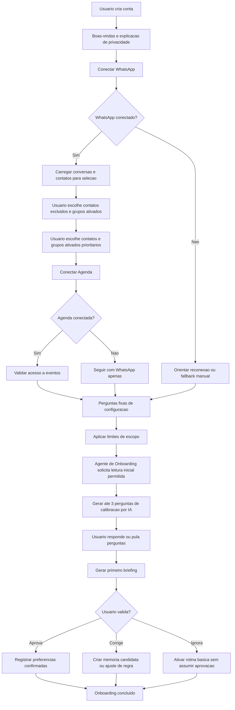

# Subjornada de Onboarding do MVP Co-CEO

## Objetivo

Este documento detalha a subjornada de onboarding do MVP do Co-CEO.

O objetivo do onboarding nao e configurar a plataforma inteira. O objetivo e levar o empreendedor ate o primeiro valor percebido com o menor atrito possivel:

> conectar canais minimos, definir limites basicos, escolher o que nao sera supervisionado e receber o primeiro briefing util.

O onboarding deve ser progressivo. Ele coleta o essencial no inicio e deixa o Co-CEO aprender com validacoes, correcoes e memorias candidatas ao longo do uso.

## Posicao na Jornada Macro

Esta subjornada deriva da jornada macro descrita em `02-jornada-macro-mvp.md`.

Ela detalha o trecho:

- criar conta;
- onboarding inicial;
- conectar WhatsApp;
- conectar Agenda;
- definir horarios de briefing;
- definir regras, limites e assuntos sensiveis;
- fazer leitura inicial de contexto;
- gerar primeiro briefing;
- validar, corrigir ou ignorar;
- ativar rotina diaria.

## Taxonomia Usada

O onboarding e um workflow, nao um funcionario de IA.

Forma correta de abstrair:

- **Workflow**: Onboarding.
- **Agente condutor**: Agente de Onboarding.
- **Agentes auxiliares**: Agente de WhatsApp, Agente de Agenda, Agente de Memoria, Agente de Sintese e Agente de Aprovacao.
- **Funcionario de IA relacionado**: Secretaria ExecutivIA.
- **Interface de configuracao**: Painel web.
- **Interface de validacao e rotina**: WhatsApp.

O usuario nao precisa ver todos esses agentes. Para ele, a experiencia deve parecer simples:

> "Estou ativando meu Co-CEO e ensinando o que ele pode ou nao observar."

## Principio do Onboarding Progressivo

O onboarding deve seguir tres principios:

1. Coletar apenas o minimo necessario antes do primeiro valor.
2. Proteger privacidade antes de qualquer leitura por IA.
3. Transformar correcoes do usuario em aprendizado validavel.

Na pratica:

- perguntas fixas definem limites iniciais;
- perguntas geradas por IA calibram contexto real depois das conexoes;
- memorias importantes so viram regra apos validacao;
- acoes sensiveis nao sao executadas sem aprovacao humana.

## Fluxo Geral



## Etapas do Onboarding

### 1. Criacao de Conta

O usuario cria conta e entra no painel web.

Nesta etapa, o sistema deve explicar em linguagem simples:

- o que o Co-CEO vai observar;
- que o WhatsApp e o nucleo do MVP;
- que contatos/grupos podem ser excluidos da supervisao;
- que comunicacoes sensiveis exigem aprovacao;
- que o primeiro objetivo e gerar um briefing util.

### 2. Consentimento e Privacidade

Antes da conexao com WhatsApp, o usuario precisa entender que o Co-CEO podera acessar mensagens e metadados dentro do escopo permitido.

O texto deve deixar claro:

- o usuario pode excluir contatos e grupos da supervisao;
- o sistema nao deve processar conversas excluidas com IA;
- o usuario pode revisar limites depois;
- o Co-CEO nao envia comunicacoes sensiveis sem aprovacao no MVP.

### 3. Conexao do WhatsApp

O usuario conecta o WhatsApp.

Na arquitetura considerada, o Baileys e usado para leitura/espelhamento. O Baileys se conecta via WhatsApp Web e Linked Devices, nao via WhatsApp Business API oficial.

Depois da conexao, o sistema deve carregar dados suficientes para permitir selecao de escopo:

- conversas individuais;
- grupos;
- nomes conhecidos quando disponiveis;
- identificadores internos;
- recencia aproximada;
- volume aproximado.

O sistema deve evitar processamento por IA antes da escolha de escopo.

### 4. Selecao do Que Nao Sera Supervisionado

Esta e uma etapa central do onboarding.

No MVP, grupos devem ficar desligados por padrao. O usuario pode ativar grupos especificos depois.

O usuario deve escolher:

- contatos que o Co-CEO nao deve supervisionar;
- grupos que o Co-CEO pode supervisionar explicitamente;
- conversas pessoais, familiares ou sensiveis;
- conversas que nao devem entrar em resumo, memoria, classificacao ou briefing.

Contatos excluidos entram em uma denylist. Grupos nao ativados tambem devem se comportar como excluidos para fins de leitura, resumo, classificacao, vetorizacao e memoria.

Regra de produto:

> Conversas excluidas nao devem ser enviadas para IA, nao devem gerar resumo, nao devem gerar memoria e nao devem aparecer em briefings.

Regra especifica para grupos:

> Grupos nao devem ser supervisionados por padrao. Um grupo so entra na leitura inicial se o usuario ativar esse grupo explicitamente.

### 5. Selecao de Contatos e Grupos Prioritarios

Depois da denylist e da ativacao explicita de grupos, o usuario escolhe contatos e grupos importantes.

Exemplos:

- socios;
- clientes principais;
- leads importantes;
- fornecedores criticos;
- equipe interna;
- contador;
- advogado;
- assistente humano.

Esses itens entram em uma lista de prioridade. A lista nao significa envio automatico nem acao autonoma. Ela apenas ajuda o Co-CEO a entender relevancia.

### 6. Conexao da Agenda

O usuario conecta Google Calendar ou outra agenda disponivel.

No MVP, a Agenda e apoio contextual. Ela serve para:

- identificar reunioes futuras;
- cruzar participantes com conversas permitidas do WhatsApp;
- preparar briefing pre-reuniao;
- sugerir pontos a lembrar.

Se a Agenda nao conectar, o onboarding pode continuar, mas o usuario deve saber que a preparacao de reuniao sera limitada.

### 7. Perguntas Fixas

O onboarding deve ter poucas perguntas fixas, agrupadas no painel.

Recomendacao para o MVP:

> 8 perguntas fixas no maximo.

Perguntas fixas recomendadas:

1. Quais contatos ou conversas individuais o Co-CEO nao deve supervisionar?
2. Quais grupos voce quer ativar para supervisao? Por padrao, nenhum grupo e ativado.
3. Quais contatos ou grupos ativados sao prioritarios?
4. Em quais horarios voce quer receber briefings?
5. Quais assuntos sempre exigem aprovacao humana?
6. Que tipo de resposta o Co-CEO pode sugerir, mas nao enviar sozinho?
7. Qual tom de comunicacao voce prefere?
8. Que tipo de reuniao merece preparacao automatica e o que voce quer reduzir primeiro?

Essas perguntas criam a configuracao inicial.

### 8. Leitura Inicial Permitida

Depois das perguntas fixas e da selecao de escopo, o Agente de Onboarding pode solicitar uma leitura inicial permitida.

Essa leitura nao significa que a IA vai ler tudo. Ela deve ser um pipeline limitado, autorizado e orientado a gerar o primeiro valor.

O pipeline recomendado e:

1. Aplicar escopo permitido.
2. Coletar historico limitado.
3. Normalizar conversas.
4. Classificar relevancia.
5. Cruzar com Agenda e respostas fixas.
6. Preparar insumos para perguntas de calibracao e primeiro briefing.

#### 8.1 Aplicar Escopo Permitido

Antes de qualquer processamento por IA, o sistema aplica os filtros definidos pelo usuario.

Deve ignorar:

- contatos excluidos;
- grupos excluidos;
- grupos nao ativados;
- conversas marcadas como pessoais ou sensiveis;
- mensagens fora da janela inicial;
- midias ou anexos nao suportados no MVP.

Pode considerar:

- conversas nao excluidas;
- contatos prioritarios;
- grupos explicitamente ativados;
- metadados permitidos;
- eventos de agenda permitidos;
- respostas fixas do usuario;
- politicas de aprovacao do MVP.

Regra forte:

> Conversa excluida nao vai para LLM, nao vira embedding, nao vira resumo e nao vira memoria.

#### 8.2 Coletar Historico Limitado

O MVP nao deve tentar ler todo o historico do empreendedor.

A leitura inicial deve usar janelas curtas e diferentes por tipo de conversa.

Recomendacao inicial:

```txt
Contatos prioritarios:
- ultimos 7 a 14 dias
- ou ate 100 mensagens recentes por conversa

Conversas normais:
- ultimos 3 a 7 dias
- ou ate 30 a 50 mensagens recentes por conversa

Grupos ativados:
- ultimos 1 a 3 dias
- ou mensagens com mencao, pendencia, decisao ou sinal de relevancia
```

Esses limites podem ser ajustados depois por custo, qualidade e privacidade.

#### 8.3 Normalizar Conversas

Antes da classificacao por IA, o sistema deve transformar mensagens brutas em uma estrutura padrao.

Campos uteis:

```txt
conversation_id
conversation_type: individual | group
supervision_status: excluded | priority | normal | unknown | needs_review
participants
message_id
message_timestamp
message_author
message_direction: sent | received
message_text
has_media
media_type
is_from_user
is_group_mention
```

No MVP, quando houver audio, imagem, video, PDF ou outro anexo, o sistema registra que existe uma midia, mas nao analisa o conteudo dessa midia nesta versao.

Exemplo:

```txt
"audio recebido, conteudo nao analisado nesta versao"
"PDF recebido, conteudo nao analisado nesta versao"
```

#### 8.4 Classificar Relevancia

A primeira classificacao por IA nao deve criar memoria automaticamente.

Ela deve identificar sinais operacionais:

- pendencia;
- pergunta sem resposta;
- reuniao mencionada;
- contato importante;
- lead quente;
- promessa feita;
- prazo;
- cobranca;
- conflito;
- decisao aguardando o empreendedor;
- conversa ruidosa;
- necessidade de follow-up;
- possivel assunto sensivel.

Exemplo de saida estruturada:

```json
{
  "conversation_id": "123",
  "importance": "high",
  "urgency": "medium",
  "category": "cliente",
  "has_pending_decision": true,
  "has_follow_up": true,
  "noise_level": "low",
  "suggested_action": "incluir_no_primeiro_briefing",
  "memory_candidate": null,
  "requires_user_confirmation": true
}
```

#### 8.5 Cruzar com Agenda e Respostas Fixas

A leitura inicial deve cruzar sinais de WhatsApp com:

- eventos de Agenda permitidos;
- participantes de reunioes;
- horarios de briefing escolhidos;
- contatos prioritarios;
- assuntos sensiveis;
- tom preferido;
- regras de aprovacao.

Exemplo:

```txt
Agenda mostra reuniao com Joao amanha.
WhatsApp permitido mostra conversa recente com Joao.
Usuario marcou Joao como prioritario.
Resultado: Joao entra no primeiro briefing.
```

#### 8.6 Preparar Insumos

Ao final da leitura inicial, o sistema deve produzir insumos estruturados para as proximas duas etapas: perguntas geradas por IA e primeiro briefing.

Exemplos de insumos:

```txt
conversas_relevantes
pendencias_detectadas
reunioes_proximas
contatos_ambiguos
grupos_ruidosos
possiveis_memorias_candidatas
assuntos_sensiveis_detectados
sugestoes_de_calibracao
```

O objetivo nao e entender a vida inteira do empreendedor. O objetivo e preparar contexto suficiente para que as secoes 9 e 10 gerem, respectivamente, perguntas de calibracao e primeiro briefing.

### 9. Perguntas Geradas por IA

Depois da leitura inicial permitida, o Agente de Onboarding pode gerar perguntas de calibracao.

Recomendacao para o MVP:

> ate 3 perguntas geradas por IA no onboarding inicial.

Essas perguntas devem ser opcionais e altamente contextuais.

Elas devem:

- reduzir ambiguidade operacional;
- explicar por que estao sendo feitas;
- priorizar impacto no primeiro briefing;
- ser respondiveis rapidamente;
- nao depender de conversas excluidas;
- nao transformar inferencia em regra sem validacao;
- poder virar memoria candidata quando a resposta tiver valor recorrente.

As perguntas devem ser geradas a partir dos insumos preparados na leitura inicial, como contatos ambiguos, grupos ruidosos, reunioes proximas, pendencias detectadas e possiveis memorias candidatas.

#### Heuristica de Geracao

No MVP, o Co-CEO pode usar uma pontuacao simples de ambiguidade e relevancia para decidir se deve gerar perguntas opcionais.

Essa pontuacao nao deve ser tratada como algoritmo definitivo. Ela e uma heuristica inicial de produto para evitar perguntas demais e priorizar apenas o que melhora o primeiro briefing ou a rotina.

Regra recomendada:

```txt
Se score >= 5:
- pode gerar pergunta opcional

Se houver mais de 3 perguntas possiveis:
- priorizar as 3 com maior impacto no primeiro briefing

Se score < 5:
- nao gerar pergunta no onboarding inicial
- seguir para o primeiro briefing
```

Exemplo de pesos iniciais:

```txt
Contato aparece com frequencia: +2
Contato esta em reuniao proxima: +3
Contato nao tem categoria: +2
Contato e prioritario ou parece prioritario: +2
Ha pendencia detectada: +3
Classificacao com confianca baixa ou media: +2
Conversa vem de grupo ruidoso ativado: +1
Possivel assunto sensivel: +3
Resposta melhoraria o primeiro briefing: +3
```

Exemplo:

```txt
Joao aparece em muitas mensagens: +2
Joao esta em reuniao amanha: +3
Joao nao tem categoria: +2

Score total: 7

Pergunta opcional:
"Joao e cliente, parceiro, fornecedor ou equipe?"
```

Importante:

> Opcional significa que o usuario pode responder, pular ou deixar para depois. Condicional significa que o sistema so gera pergunta quando encontra ambiguidade relevante.

Exemplos:

- "Joao aparece com frequencia nas conversas permitidas. Ele e cliente, parceiro, fornecedor ou equipe?"
- "Esse grupo parece ter muito movimento. Quer que eu avise apenas quando houver mencao direta, decisao ou pendencia?"
- "Reunioes com clientes devem receber briefing 1 hora antes?"
- "Esse contato parece relacionado a proposta comercial. Ele deve entrar como prioridade?"
- "Quando alguem pedir status de entrega, voce prefere resposta objetiva ou mais consultiva?"

As perguntas geradas por IA nao devem ser ilimitadas. Se o sistema tiver muitas duvidas, deve priorizar as que mais impactam o primeiro briefing.

Exemplo de decisao:

```txt
Insumo:
- Joao aparece em conversa recente.
- Joao tambem aparece em reuniao amanha.
- Usuario ainda nao classificou Joao.

Pergunta gerada:
"Joao aparece nas suas conversas e em uma reuniao amanha. Ele e cliente, parceiro, fornecedor ou equipe?"

Possivel resultado:
- Se o usuario responder "cliente estrategico", isso vira memoria candidata ou confirmada, dependendo do fluxo de validacao.
```

### 10. Primeiro Briefing

O primeiro briefing e o primeiro momento forte de valor.

Ele deve mostrar algo como:

- principais conversas relevantes;
- pendencias percebidas;
- reunioes proximas;
- pontos que talvez precisem de decisao;
- sugestoes de proximos passos;
- limites que ainda precisam de confirmacao.

O primeiro briefing nao deve ser longo. Ele precisa ser util, claro e corrigivel.

Formato recomendado:

```txt
1. O que importa agora
2. Pendencias percebidas
3. Reunioes proximas
4. Decisoes que talvez dependam de voce
5. Perguntas de calibracao, se houver
```

Exemplo:

```txt
Fiz uma primeira leitura do que voce autorizou.

1. Reuniao com Joao amanha as 10h
Ultima conversa: ele pediu atualizacao da proposta.
Possivel decisao: enviar versao final hoje ou alinhar prazo na reuniao.

2. Conversa com Maria
Ela perguntou sobre disponibilidade e ainda nao teve resposta.

3. Grupo Comercial
Identifiquei uma pendencia: proposta do cliente X precisa de retorno.

Pergunta de calibracao:
Quer que eu considere Joao como cliente estrategico?
```

O primeiro briefing deve sinalizar incerteza quando houver inferencia.

Exemplo:

```txt
"Parece ser uma pendencia comercial, mas ainda preciso da sua confirmacao."
```

Ele nao deve incluir conversas excluidas, grupos nao ativados, conteudo de midias nao analisadas ou memorias candidatas como se fossem fatos confirmados.

### 11. Validacao do Usuario

O usuario pode:

- aprovar;
- corrigir;
- ignorar;
- pedir para remover um contato;
- marcar algo como ruido;
- confirmar uma regra;
- rejeitar uma memoria candidata.

Essa validacao alimenta a memoria operacional.

## Perguntas Fixas vs Perguntas Geradas por IA

### Perguntas Fixas

Perguntas fixas servem para regras essenciais que nao dependem de analise de contexto.

Elas definem:

- permissao;
- escopo;
- horarios;
- assuntos sensiveis;
- tom;
- prioridade;
- objetivo inicial.

Elas devem ser previsiveis, auditaveis e iguais para todos os usuarios do MVP.

### Perguntas Geradas por IA

Perguntas geradas por IA servem para calibrar o Co-CEO com base no contexto real do usuario.

Elas devem surgir apenas depois de:

- WhatsApp conectado;
- contatos excluidos e grupos ativados definidos;
- Agenda conectada ou explicitamente pulada;
- leitura inicial permitida concluida.

Elas devem ter limite e criterio.

No MVP:

- maximo de 3 perguntas no onboarding inicial;
- perguntas sempre opcionais;
- perguntas devem explicar por que estao sendo feitas;
- respostas podem virar memoria candidata, nunca regra sensivel automatica sem validacao.

## Papel do Agente de Onboarding

O Agente de Onboarding conduz o workflow de ativacao inicial.

Responsabilidades:

- guiar o usuario pelas etapas;
- chamar o Agente de WhatsApp para listar conversas e contatos;
- chamar o Agente de Agenda para validar eventos;
- aplicar regras de escopo antes de qualquer leitura por IA;
- chamar o Agente de Memoria para registrar configuracoes e memorias candidatas;
- chamar o Agente de Sintese para gerar o primeiro briefing;
- acionar a camada de Aprovacao quando houver regra sensivel.

O Agente de Onboarding nao e um funcionario de IA. Ele e um agente tecnico interno.

## Contexto Necessario Para o Agente

O Agente de Onboarding precisa de contexto, mas nao precisa de fine-tuning no MVP.

### Nao Precisa no MVP

- fine-tuning;
- treinamento proprio;
- RAG pesado de documentos;
- autonomia ampla.

### Precisa no MVP

- prompt de sistema bem definido;
- politica de produto do Co-CEO;
- regras de aprovacao humana;
- taxonomia de contatos, grupos e assuntos;
- respostas fixas do usuario;
- denylist e priority list;
- eventos de agenda permitidos;
- conversas permitidas;
- memorias confirmadas;
- memorias candidatas;
- schema de saida estruturada.

### RAG ou Recuperacao Contextual

No MVP, o mais correto e falar em recuperacao contextual operacional, nao em RAG pesado.

O sistema deve buscar contexto em bases internas:

- configuracoes do usuario;
- memorias confirmadas;
- conversas permitidas;
- agenda;
- decisoes anteriores;
- regras de aprovacao.

Essa recuperacao pode usar busca relacional, filtros por tempo, busca semantica ou combinacao das tres.

## Memoria no Onboarding

O onboarding cria tres tipos de informacao:

### Configuracao Confirmada

Informacoes explicitamente definidas pelo usuario.

Exemplos:

- horarios de briefing;
- contatos excluidos;
- contatos prioritarios;
- assuntos sensiveis;
- tom preferido.

### Memoria Candidata

Informacoes inferidas ou sugeridas pelo sistema, mas ainda nao confirmadas.

Exemplos:

- "Joao parece ser cliente importante";
- "Grupo X parece ter muito ruido";
- "Reunioes com cliente talvez precisem briefing 1 hora antes".

### Memoria Confirmada

Informacoes aceitas ou corrigidas pelo usuario.

Exemplos:

- "Joao e cliente estrategico";
- "Grupo X so deve gerar alerta quando houver mencao direta";
- "Reunioes comerciais recebem briefing 1 hora antes".

Regra:

> Memoria candidata nao deve ser usada como verdade operacional sensivel.

## Tratamento de Contatos e Grupos

Cada conversa pode ter um status operacional.

```txt
excluded      = nao supervisionar
priority      = supervisionar com alta relevancia
normal        = supervisionar normalmente
unknown       = aguardar mais contexto
needs_review  = pedir confirmacao ao usuario
```

No caso de grupos, o estado padrao no MVP deve ser `excluded` ou `needs_review`, ate que o usuario ative o grupo explicitamente.

O sistema deve permitir revisao posterior.

Exemplos:

- mover contato de normal para excluded;
- mover grupo de priority para normal;
- confirmar contato unknown como cliente;
- marcar grupo como ruido.

## Consideracoes Tecnicas Sobre Baileys

O Baileys permite receber eventos de mensagens, chats, contatos e grupos.

Pontos relevantes para o onboarding:

- o Baileys pode entregar historico inicial de chats, contatos e mensagens via `messaging-history.set`;
- eventos em tempo real chegam por `messages.upsert`;
- eventos de chat, contato e grupo ajudam a montar a lista inicial de supervisao;
- a configuracao `shouldIgnoreJid` permite ignorar um JID, fazendo com que eventos daquele JID nao sejam disparados e mensagens daquele JID nao sejam descriptografadas;
- `shouldSyncHistoryMessage` pode controlar processamento de historico;
- a aplicacao tambem deve manter sua propria denylist, pois a decisao de produto precisa existir acima da biblioteca.

Decisao recomendada para o MVP:

> O Co-CEO deve aplicar filtros de escopo antes de qualquer processamento por IA. Mesmo que mensagens ou metadados sejam recebidos tecnicamente, conversas excluidas nao devem ser resumidas, classificadas, vetorizadas ou memorizadas.

Referencias:

- [Baileys Introduction](https://baileys.wiki/docs/intro/)
- [Baileys SocketConfig](https://baileys.wiki/docs/api/type-aliases/SocketConfig/)
- [Baileys History Sync](https://baileys.wiki/docs/socket/history-sync/)
- [Baileys Receiving Updates](https://baileys.wiki/docs/socket/receiving-updates/)

## Falhas e Excecoes

### WhatsApp Nao Conecta

O sistema deve:

- orientar reconexao;
- permitir tentar novamente;
- explicar que sem WhatsApp o MVP perde o nucleo de valor;
- oferecer fallback manual apenas se fizer sentido para demonstracao.

### Lista de Contatos Incompleta

O sistema deve:

- mostrar o que conseguiu identificar;
- permitir busca manual;
- permitir adicionar exclusoes depois;
- marcar contatos desconhecidos como `unknown`.

### Usuario Nao Escolhe Excluidos

O sistema deve pedir confirmacao explicita:

> "Voce confirma que nao deseja excluir nenhuma conversa da supervisao?"

Sem essa confirmacao, a leitura inicial por IA nao deve avancar.

### Agenda Nao Conecta

O onboarding pode continuar.

O sistema deve deixar claro:

- briefings diarios continuam possiveis;
- preparacao de reuniao fica limitada;
- a Agenda pode ser conectada depois.

### Usuario Pula Perguntas de IA

O onboarding continua.

Perguntas puladas podem voltar como calibracao futura, se ainda forem relevantes.

### Primeiro Briefing Ruim

Se o primeiro briefing estiver ruim, o usuario deve conseguir corrigir rapidamente:

- "isso e ruido";
- "esse contato nao deve ser supervisionado";
- "isso e importante";
- "esse tom esta errado";
- "nao use essa memoria".

## Criterio de Onboarding Concluido

O onboarding e considerado concluido quando:

- conta criada;
- WhatsApp conectado ou fallback explicitamente aceito;
- contatos excluidos revisados ou confirmados como vazios;
- grupos ativados revisados ou pulados;
- contatos/grupos prioritarios definidos ou pulados;
- horarios de briefing definidos;
- regras basicas de aprovacao definidas;
- Agenda conectada ou pulada;
- primeiro briefing gerado;
- usuario aprovou, corrigiu ou ignorou conscientemente o primeiro briefing;
- rotina diaria ativada.

## O Que Nao Entra no Onboarding do MVP

Nao entra no onboarding inicial:

- configuracao profunda de CRM;
- financeiro;
- juridico;
- RH;
- marketing;
- automacoes autonomas;
- permissao ampla para envio sem aprovacao;
- mapeamento completo de todos os clientes;
- coleta extensa de dados da empresa;
- fine-tuning;
- treinamento personalizado de modelo.

Esses pontos podem aparecer depois como expansao, configuracao avancada ou proxima versao.

## Decisoes de Produto

- O onboarding deve ser progressivo.
- A selecao de contatos excluidos e grupos ativados vem antes da primeira leitura por IA.
- O usuario deve poder excluir conversas pessoais, familiares ou sensiveis.
- Perguntas fixas devem ser limitadas a 8 no MVP.
- Perguntas geradas por IA devem ser limitadas a 3 no onboarding inicial.
- Perguntas geradas por IA dependem de contexto permitido, nao de acesso irrestrito.
- O Agente de Onboarding conduz o workflow, mas nao e um funcionario de IA.
- O primeiro valor do onboarding e o primeiro briefing util.
- Memorias inferidas durante onboarding entram como candidatas ate validacao.
- Comunicacoes sensiveis continuam exigindo aprovacao humana.

## Proximos Artefatos Relacionados

Depois desta subjornada, as proximas etapas devem detalhar:

- subjornada do WhatsApp;
- subjornada de briefings;
- subjornada de preparacao de reuniao;
- subjornada de sugestao e aprovacao de resposta;
- subjornada de memoria operacional.
